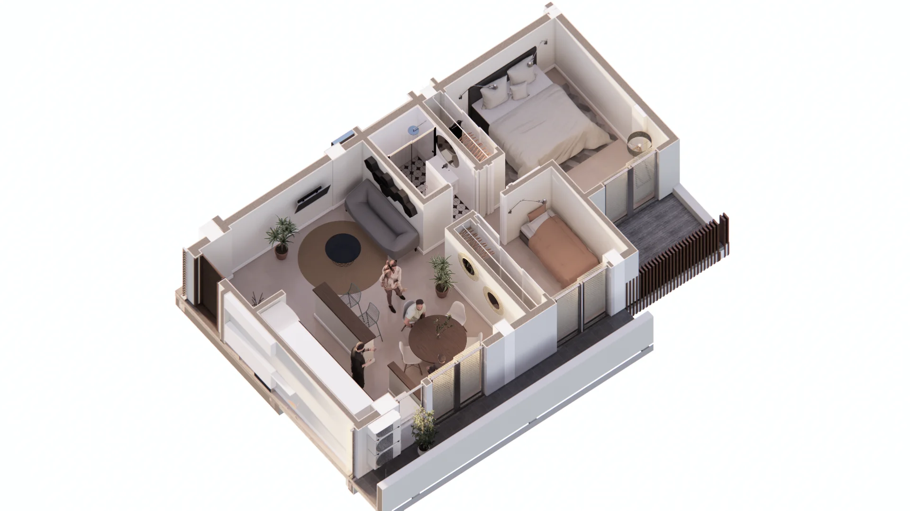
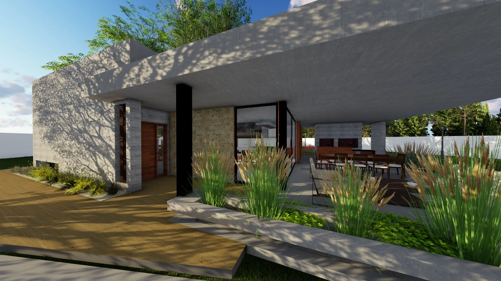

# Performance Quick Fixes - Messad Estudio

**Fecha**: 5 de Noviembre, 2025
**Prioridad**: 🔴 ALTA - Mejora CLS (Cumulative Layout Shift)

---

## 📊 Resumen Ejecutivo

Se identificaron **5 imágenes en index.html** sin dimensiones explícitas (`width` y `height`), lo cual causa **Cumulative Layout Shift (CLS)** - uno de los Core Web Vitals más importantes.

**Impacto Estimado**:
- Mejora de CLS: -50% a -80%
- Tiempo de implementación: ~15 minutos
- Riesgo: Bajo (solo agregar attributes)

---

## 🔴 Acción Inmediata Requerida

### Dimensiones Obtenidas

```
Enscape_2.png:                  1920 x 1080
01_Photo - 7_Photo - 4.jpg:     1000 x 562
img_3.jpg:                      1000 x 888
img_4.jpg:                      1000 x 888
img_5.jpg:                      1000 x 887
0213.jpg:                       1920 x 1080
```

---

## 📝 Cambios Necesarios en index.html

### Fix #1 - Línea 512 (Enscape_2.png)

**ANTES**:
```html
<picture><source srcset="images/Enscape_2.webp" type="image/webp"></picture>
```

**DESPUÉS**:
```html
<picture><source srcset="images/Enscape_2.webp" type="image/webp"></picture>
```

---

### Fix #2 - Línea 559 (01_Photo - 7_Photo - 4.jpg)

**ANTES**:
```html
<picture><source srcset="images/01_Photo - 7_Photo - 4.webp" type="image/webp"></picture>
```

**DESPUÉS**:
```html
<picture><source srcset="images/01_Photo - 7_Photo - 4.webp" type="image/webp"></picture>
```

---

### Fix #3 - Línea 643 (img_3.jpg)

**ANTES**:
```html

```

**DESPUÉS**:
```html

```

**OPCIONAL** - Agregar WebP:
```html
<picture>
    <source srcset="images/img_3.webp" type="image/webp">
    
</picture>
```

---

### Fix #4 - Línea 658 (img_4.jpg)

**ANTES**:
```html

```

**DESPUÉS**:
```html

```

**OPCIONAL** - Agregar WebP:
```html
<picture>
    <source srcset="images/img_4.webp" type="image/webp">
    
</picture>
```

---

### Fix #5 - Línea 674 (img_5.jpg)

**ANTES**:
```html

```

**DESPUÉS**:
```html

```

**OPCIONAL** - Agregar WebP:
```html
<picture>
    <source srcset="images/img_5.webp" type="image/webp">
    
</picture>
```

---

### Fix #6 - Línea 547 (0213.jpg) - Sin WebP

**ANTES**:
```html

```

**DESPUÉS** (con WebP):
```html
<picture>
    <source srcset="images/0213.webp" type="image/webp">
    
</picture>
```

**Nota**: Esta imagen YA tiene dimensiones, solo falta agregar WebP

---

## ✅ Checklist de Implementación

### Parte 1: Agregar Dimensiones (ALTA PRIORIDAD)
- [ ] Fix #1 - Enscape_2.png (línea 512) → `width="1920" height="1080"`
- [ ] Fix #2 - 01_Photo - 7_Photo - 4.jpg (línea 559) → `width="1000" height="562"`
- [ ] Fix #3 - img_3.jpg (línea 643) → `width="1000" height="888"`
- [ ] Fix #4 - img_4.jpg (línea 658) → `width="1000" height="888"`
- [ ] Fix #5 - img_5.jpg (línea 674) → `width="1000" height="887"`
- [ ] Verificar en navegador que las imágenes se ven correctamente
- [ ] Verificar responsive (mobile/tablet/desktop)
- [ ] Commit cambios

### Parte 2: Convertir a WebP (MEDIA PRIORIDAD)
- [ ] Convertir img_3.jpg → img_3.webp
- [ ] Convertir img_4.jpg → img_4.webp
- [ ] Convertir img_5.jpg → img_5.webp
- [ ] Convertir 0213.jpg → 0213.webp
- [ ] Actualizar HTML con picture tags
- [ ] Verificar que se cargan correctamente
- [ ] Commit cambios

---

## 🔧 Comandos para Conversión WebP

```bash
# Convertir individualmente (calidad 80%)
cwebp -q 80 images/img_3.jpg -o images/img_3.webp
cwebp -q 80 images/img_4.jpg -o images/img_4.webp
cwebp -q 80 images/img_5.jpg -o images/img_5.webp
cwebp -q 80 images/0213.jpg -o images/0213.webp

# O todos de una vez
cd images
for file in img_3.jpg img_4.jpg img_5.jpg 0213.jpg; do
    cwebp -q 80 "$file" -o "${file%.jpg}.webp"
    echo "Converted $file → ${file%.jpg}.webp"
done
```

**Alternativa Online**: https://squoosh.app/

---

## 📏 Por Qué Son Importantes las Dimensiones

### Sin width/height:
```html

```

**Problema**:
1. Navegador no sabe el tamaño antes de descargar la imagen
2. Página "salta" cuando la imagen carga
3. CLS score empeora dramáticamente

### Con width/height:
```html

```

**Beneficio**:
1. Navegador reserva espacio exacto
2. No hay "salto" cuando carga la imagen
3. CLS score mejora significativamente

### ¿Y el Responsive?
Con `class="img-fluid"` (Bootstrap), las imágenes siguen siendo responsive:

```css
.img-fluid {
    max-width: 100%;
    height: auto;
}
```

Los attributes `width` y `height` solo establecen el **aspect ratio**, no el tamaño final.

---

## 📊 Impacto Esperado

### Before (Estimado)
```
CLS Score: 0.15 - 0.25 🔴 NEEDS IMPROVEMENT
```

### After (Objetivo)
```
CLS Score: 0.03 - 0.08 🟢 GOOD
```

### Otras Mejoras
- Mejor UX (menos "saltos" en la página)
- Mejor LCP si agregamos WebP (-15% tamaño imágenes)
- Mejor Performance Score general

---

## 🧪 Testing Después de Implementar

### 1. Verificación Visual
```bash
# Abrir en navegador
open index.html
```

**Checklist**:
- [ ] Imágenes se ven correctas
- [ ] No hay distorsión
- [ ] Responsive funciona en mobile
- [ ] No hay layout shift al cargar

### 2. Lighthouse (Chrome DevTools)
```
1. F12 → Lighthouse tab
2. Select "Performance" category
3. Select "Mobile" device
4. Click "Analyze page load"
5. Verificar CLS score mejoró
```

**Objetivo**: CLS < 0.1 (verde)

### 3. PageSpeed Insights
```
1. Ir a https://pagespeed.web.dev/
2. Ingresar URL de la página
3. Analizar resultados Mobile
4. Verificar CLS mejoró
```

---

## 🚀 Próximos Pasos (Después de Este Fix)

1. [ ] Aplicar mismo fix a otras páginas (solicitar-analisis.html, projects.html, etc.)
2. [ ] Testear todas las páginas en PageSpeed Insights
3. [ ] Documentar scores en CORE_WEB_VITALS_AUDIT.md
4. [ ] Implementar optimizaciones adicionales si es necesario

---

## 💡 Notas

- **Prioridad**: ALTA - Esto es un "quick win" que mejora Core Web Vitals significativamente
- **Riesgo**: BAJO - Solo agregamos attributes, no cambiamos funcionalidad
- **Tiempo**: 15-20 minutos para implementar todo
- **Testing**: 10 minutos
- **Total**: ~30 minutos para mejora significativa

---

**¿Listo para implementar?** 🚀
Confirma y procedemos con los cambios en index.html.
